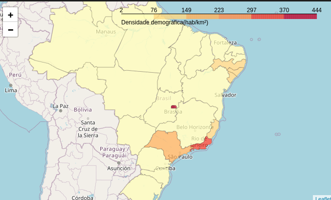
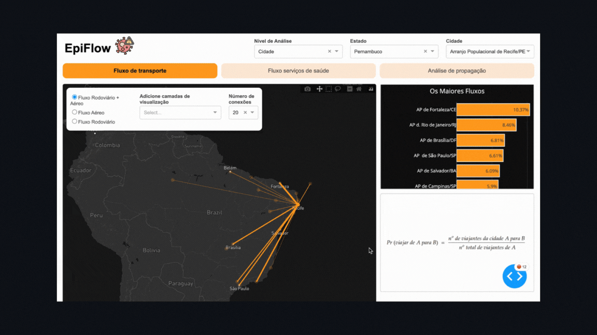

# Replica de Proyecto: Alerta Pandemia

Este proyecto es una réplica del sistema **Alerta Pandemia**, que utiliza datos de movilidad humana para rastrear la propagación de enfermedades infecciosas en Brasil. Utiliza herramientas como Python, Neo4j, Postgres y otras para el análisis de datos, modelado y visualización.

## Avances recientes

Se han añadido nuevas fases de análisis para calcular probabilidades y modelar las rutas de transmisión de enfermedades basadas en datos de movilidad. A continuación, se muestran algunas evidencias visuales de los avances obtenidos.

## Evidencia

### Imagen 1: `evidencia2.png`

### Imagen 2: `evidencia.gif`

### Imagen 3: `prueba 1.png`

